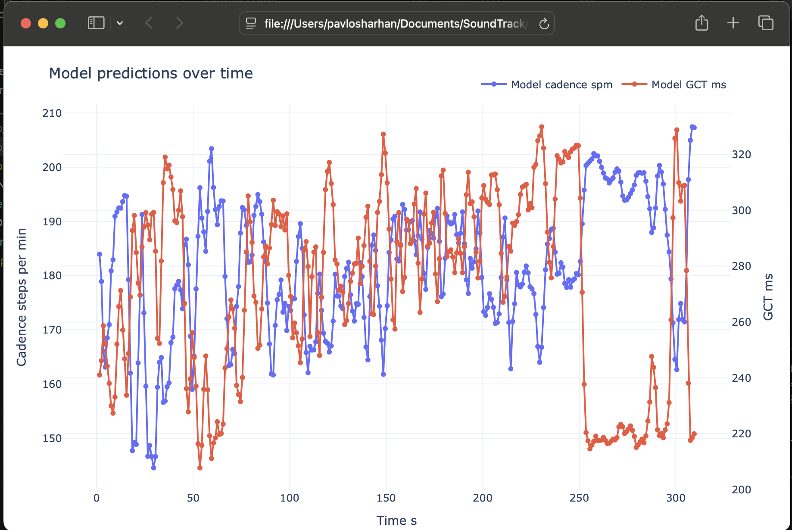

#  SoundTrackDB implementation

## This is a fork of Columbia-ICSL/SoundTrackDB:main

Pre-trained weights included. The results are:<br>
- Cadence MAE - 2.172 steps per minute<br>
- Ground Contact Time MAE 25.6ms<br>

<b>Train</b> (takes about 15min on Mac M2 Air):

```
python3 train.py
```

<b>Run</b> on a video with default checkpoint:
```
python3 demo.py /path/to/video.mp4
```
The result on test audio included in the repository (is not present in the dataset):



<br><br>
The paper:<br>
> Jingping Nie, Runxi Wan, and Xiaofan (Fred) Jiang.  
> **"Non-Contact Audio-Based Running Metrics Detection Using Mobile Devices."**  
> *Proceedings of the 5th ACM International Workshop on Intelligent Acoustic Systems and Applications (IASA’24),* 2024.  
> DOI: [https://doi.org/10.1145/3729486](https://doi.org/10.1145/3729486)