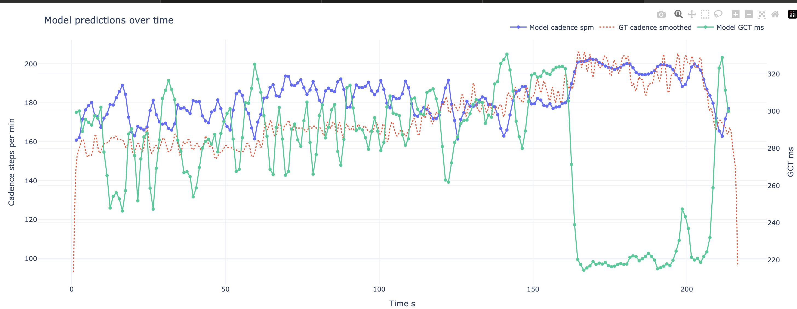

#  SoundTrackDB implementation
Pre-trained weights included. The results are:<br>
- Cadence MAE - 2.172 steps per minute<br>
- Ground Contact Time MAE 25.6ms<br>

<b>Train</b> (takes about 15min on Mac M2 Air):

```
python3 train.py
```

<b>Run</b> on a video with default checkpoint:
```
python3 demo.py /path/to/video.mp4
```
The result:



**SoundTrackDB** is a comprehensive dataset of treadmill running sounds, designed to support research and development in contactless running metric estimation.  


📊 **Highlights**:
- **40 hours** of audio data  
- **61 subjects**, **363 sessions**  
- Recorded in **13 public gyms**  
- Developed in collaboration with a **licensed running coach**

This dataset captures real-world variability and is ideal for training and evaluating ML models that estimate running metrics such as:
- **Cadence**
- **Ground Contact Time (GCT)**
- And many other possible metrics with our labels

## Contents & Data Alignment

There are 5 folders in the "data" directory, each containing 363 files with the same prefixes, corresponding to the 363 running sessions. The filenames are in the format "date-code_subject-id_speed_trial.filetype". For example, "d01_P01_6_0.m4a" corresponds to the audio recording of the running session on date "d01" of subject "P01" running at "6" mph, and is the "0"th trial running 6 mph for that day.

Here is an overview of what a file in each folder corresponds to.

- audio_m4a: the audio recording of the phone placed on the treadmill control panel. Consider this to be the "main" timeline such that the timestamps in all other files refer to the time of the audio recording.
- gct_csv: the ground truth labels of cadence and ground contact time (GCT). Each row represents a single step. The important columns are (1) "YOLO_Start_Time" that corresponds to when the specifc step makes contact with the treadmill belt in the audio recording and (2) "YOLO_Contact_Time" that corresponds to the contact time of the specific step. Cadence is provided as a column but can also be derived in a custom way depending on the implementation. This file also includes and the metrics from the baseline devices which we aligned and derived. The raw output file of the baseline devices are also provide in the other folders.
- imu_csv: the 3-axis (x, y, z) imu data of the running session collected by the phone placed on the treadmill control panel, also aligned with the audio recording. We experimented with this modality in our Microbenchmark but found no added value to the audio.
- runscribe_csv: the output csv from the RunScribe app. We manually aligned the steps based on the method describe in Data Syncing Section of the manuscript such that the "time_sec" column is aligned with the audio.
- watch_csv: the output csv from the sport watches we used. We pre-processed to have consistent format and aligned it to the audio.

## Meta Data

We have organized data collected from our Pre-Run and Post-Run Questionnaires.

- SoundTrack_session_info.csv contains the meta data of the 363 running session, including information such as exertion level, muscle sore, etc.
- SoundTrack_subject_info.csv contains the meta data of the 61 participants, including information such as age, weight, running expertise, etc.

---

# 📱 SoundTrack

We also introduce **SoundTrack**, a **contactless mobile solution** that estimates cadence and GCT by analyzing treadmill running sounds using **on-device machine learning** — no wearables required.

<p align="center">
  <a href="https://drive.google.com/file/d/1r_mB1uSDz3mM4MPNEJ8hgf9vrZ9a4pme/view?usp=drive_link" target="_blank">
    
  </a>
</p>

---
